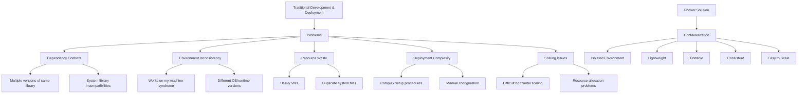

```mermaid
flowchart TD
    A[Traditional Development & Deployment] --> B[Problems]

    B --> C[Dependency Conflicts]
    C --> C1[Multiple versions of same library]
    C --> C2[System library incompatibilities]

    B --> D[Environment Inconsistency]
    D --> D1[Works on my machine syndrome]
    D --> D2[Different OS/runtime versions]

    B --> E[Resource Waste]
    E --> E1[Heavy VMs]
    E --> E2[Duplicate system files]

    B --> F[Deployment Complexity]
    F --> F1[Complex setup procedures]
    F --> F2[Manual configuration]

    B --> G[Scaling Issues]
    G --> G1[Difficult horizontal scaling]
    G --> G2[Resource allocation problems]

    H[Docker Solution] --> I[Containerization]
    I --> J[Isolated Environment]
    I --> K[Lightweight]
    I --> L[Portable]
    I --> M[Consistent]
    I --> N[Easy to Scale]
```
