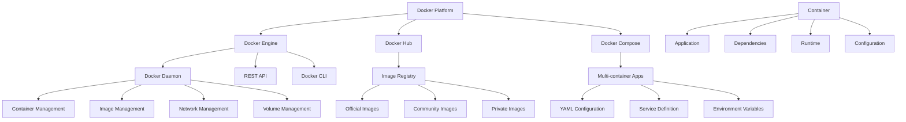

```mermaid
flowchart TD
    A[Docker Platform] --> B[Docker Engine]
    A --> C[Docker Hub]
    A --> D[Docker Compose]

    B --> E[Docker Daemon]
    B --> F[REST API]
    B --> G[Docker CLI]

    E --> H[Container Management]
    E --> I[Image Management]
    E --> J[Network Management]
    E --> K[Volume Management]

    C --> L[Image Registry]
    L --> L1[Official Images]
    L --> L2[Community Images]
    L --> L3[Private Images]

    D --> M[Multi-container Apps]
    M --> M1[YAML Configuration]
    M --> M2[Service Definition]
    M --> M3[Environment Variables]

    N[Container] --> O[Application]
    N --> P[Dependencies]
    N --> Q[Runtime]
    N --> R[Configuration]
```
