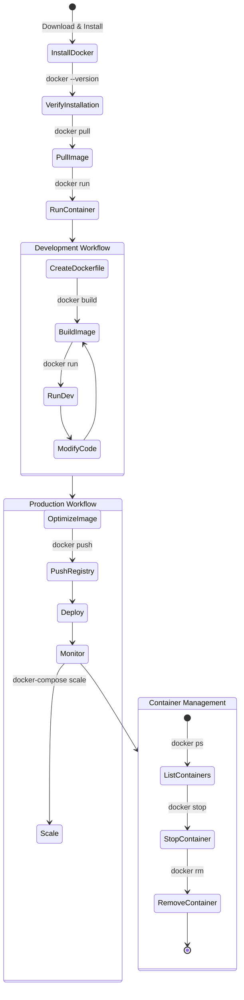

```mermaid
stateDiagram-v2
    [*] --> InstallDocker: Download & Install
    InstallDocker --> VerifyInstallation: docker --version

    VerifyInstallation --> PullImage: docker pull
    PullImage --> RunContainer: docker run

    state "Development Workflow" as Dev {
        CreateDockerfile --> BuildImage: docker build
        BuildImage --> RunDev: docker run
        RunDev --> ModifyCode
        ModifyCode --> BuildImage
    }

    state "Production Workflow" as Prod {
        OptimizeImage --> PushRegistry: docker push
        PushRegistry --> Deploy
        Deploy --> Monitor
        Monitor --> Scale: docker-compose scale
    }

    RunContainer --> Dev
    Dev --> Prod

    state "Container Management" as Manage {
        [*] --> ListContainers: docker ps
        ListContainers --> StopContainer: docker stop
        StopContainer --> RemoveContainer: docker rm
        RemoveContainer --> [*]
    }

    Monitor --> Manage
```
