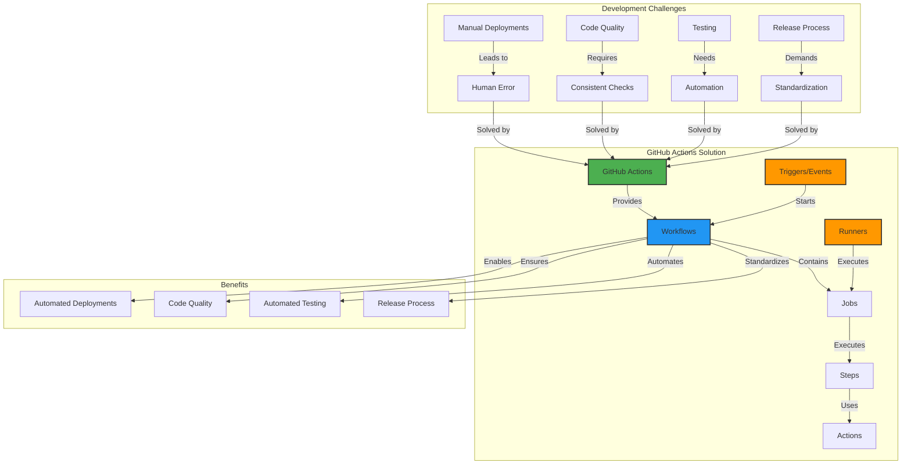

```mermaid
graph TB
    subgraph "Development Challenges"
        A[Manual Deployments] -->|Leads to| P1[Human Error]
        B[Code Quality] -->|Requires| P2[Consistent Checks]
        C[Testing] -->|Needs| P3[Automation]
        D[Release Process] -->|Demands| P4[Standardization]
    end

    subgraph "GitHub Actions Solution"
        GA[GitHub Actions] -->|Provides| W[Workflows]
        W -->|Contains| J[Jobs]
        J -->|Executes| S[Steps]
        S -->|Uses| AC[Actions]

        T1[Triggers/Events]-->|Starts|W
        R[Runners]-->|Executes|J
    end

    subgraph "Benefits"
        W -->|Enables| AD[Automated Deployments]
        W -->|Ensures| CQ[Code Quality]
        W -->|Automates| AT[Automated Testing]
        W -->|Standardizes| RP[Release Process]
    end

    P1 & P2 & P3 & P4 -->|Solved by| GA

    style GA fill:#4CAF50,stroke:#333,stroke-width:2px
    style W fill:#2196F3,stroke:#333,stroke-width:2px
    style T1 fill:#FF9800,stroke:#333,stroke-width:2px
    style R fill:#FF9800,stroke:#333,stroke-width:2px
```
