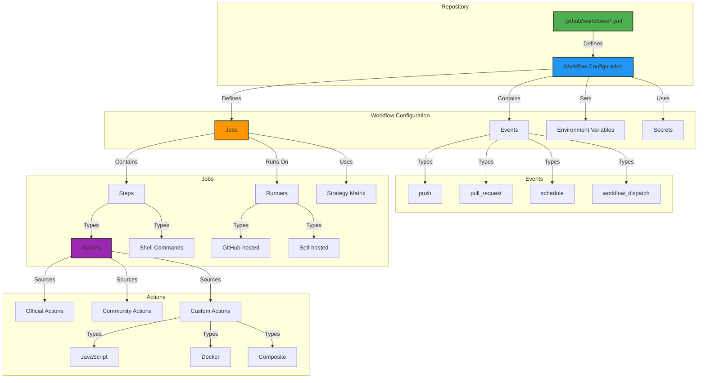

```mermaid
graph TB
    subgraph "Repository"
        WF[.github/workflows/*.yml] -->|Defines| CONF[Workflow Configuration]
    end

    subgraph "Workflow Configuration"
        CONF -->|Contains| EV[Events]
        CONF -->|Defines| J[Jobs]
        CONF -->|Sets| ENV[Environment Variables]
        CONF -->|Uses| SEC[Secrets]
    end

    subgraph "Events"
        EV -->|Types| E1[push]
        EV -->|Types| E2[pull_request]
        EV -->|Types| E3[schedule]
        EV -->|Types| E4[workflow_dispatch]
    end

    subgraph "Jobs"
        J -->|Runs On| R[Runners]
        J -->|Contains| S[Steps]
        J -->|Uses| STR[Strategy Matrix]

        S -->|Types| S1[Actions]
        S -->|Types| S2[Shell Commands]

        R -->|Types| R1[GitHub-hosted]
        R -->|Types| R2[Self-hosted]
    end

    subgraph "Actions"
        S1 -->|Sources| A1[Official Actions]
        S1 -->|Sources| A2[Community Actions]
        S1 -->|Sources| A3[Custom Actions]

        A3 -->|Types| CA1[JavaScript]
        A3 -->|Types| CA2[Docker]
        A3 -->|Types| CA3[Composite]
    end

    style WF fill:#4CAF50,stroke:#333,stroke-width:2px
    style CONF fill:#2196F3,stroke:#333,stroke-width:2px
    style J fill:#FF9800,stroke:#333,stroke-width:2px
    style S1 fill:#9C27B0,stroke:#333,stroke-width:2px
```
