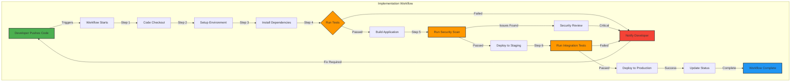

```mermaid
graph TB
    subgraph "Implementation Workflow"
        Start[Developer Pushes Code] -->|Triggers| A[Workflow Starts]

        A -->|Step 1| B[Code Checkout]
        B -->|Step 2| C[Setup Environment]
        C -->|Step 3| D[Install Dependencies]

        D -->|Step 4| E{Run Tests}

        E -->|Failed| F[Notify Developer]
        F -->|Fix Required| Start

        E -->|Passed| G[Build Application]
        G -->|Step 5| H[Run Security Scan]

        H -->|Issues Found| I[Security Review]
        I -->|Critical| F

        H -->|Passed| J[Deploy to Staging]
        J -->|Step 6| K[Run Integration Tests]

        K -->|Failed| F
        K -->|Passed| L[Deploy to Production]

        L -->|Success| M[Update Status]
        M -->|Complete| End[Workflow Complete]
    end

    style Start fill:#4CAF50,stroke:#333,stroke-width:2px
    style E fill:#FF9800,stroke:#333,stroke-width:2px
    style H fill:#FF9800,stroke:#333,stroke-width:2px
    style K fill:#FF9800,stroke:#333,stroke-width:2px
    style F fill:#f44336,stroke:#333,stroke-width:2px
    style End fill:#2196F3,stroke:#333,stroke-width:2px
```
