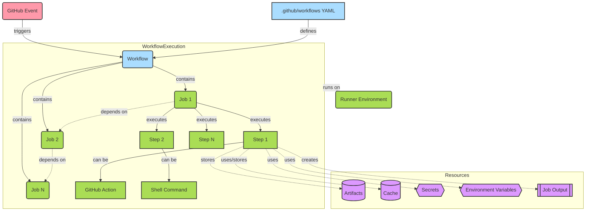

# GitHub Actions Flowchart

## Key Components Explained

1. **GitHub Event**: Triggers the workflow execution (e.g., push, pull request, scheduled event)
2. **Workflow File**: YAML configuration in `.github/workflows/` that defines the entire process
3. **Workflow**: The complete automated process containing one or more jobs
4. **Jobs**: Collections of steps that execute on the same runner
5. **Steps**: Individual tasks that run commands or actions
6. **Actions**: Reusable code units that perform specific tasks
7. **Commands**: Shell commands executed directly on the runner
8. **Runner Environment**: The server where jobs execute (GitHub-hosted or self-hosted)
9. **Resources**:
   - **Artifacts**: Files persisted after a job completes
   - **Cache**: Dependency cache to speed up workflows
   - **Secrets**: Encrypted sensitive data
   - **Environment Variables**: Configuration data
   - **Outputs**: Values passed between jobs or steps

## Flow Sequence

1. A GitHub event occurs (e.g., code push)
2. The event triggers workflows defined in YAML files
3. Each workflow executes its jobs (in parallel or sequentially)
4. Each job runs on a specific runner environment
5. Jobs execute their steps in sequence
6. Steps can use actions, run commands, and interact with resources
7. Output from the workflow (artifacts, logs) is available after completion
