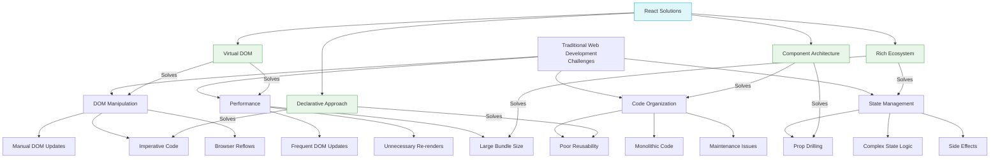

```mermaid
flowchart TD
    A[Traditional Web Development<br>Challenges] --> B[DOM Manipulation]
    A --> C[State Management]
    A --> D[Code Organization]
    A --> E[Performance]

    B --> B1[Manual DOM Updates]
    B --> B2[Imperative Code]
    B --> B3[Browser Reflows]

    C --> C1[Complex State Logic]
    C --> C2[Prop Drilling]
    C --> C3[Side Effects]

    D --> D1[Monolithic Code]
    D --> D2[Poor Reusability]
    D --> D3[Maintenance Issues]

    E --> E1[Frequent DOM Updates]
    E --> E2[Unnecessary Re-renders]
    E --> E3[Large Bundle Size]

    %% React Solutions
    React[React Solutions] --> VirtualDOM[Virtual DOM]
    React --> Declarative[Declarative Approach]
    React --> Components[Component Architecture]
    React --> Ecosystem[Rich Ecosystem]

    VirtualDOM --> |Solves| B
    VirtualDOM --> |Solves| E

    Declarative --> |Solves| B2
    Declarative --> |Solves| D2

    Components --> |Solves| D
    Components --> |Solves| C2

    Ecosystem --> |Solves| C
    Ecosystem --> |Solves| E3

    style React fill:#e0f7fa,stroke:#00acc1
    style VirtualDOM fill:#e8f5e9,stroke:#43a047
    style Declarative fill:#e8f5e9,stroke:#43a047
    style Components fill:#e8f5e9,stroke:#43a047
    style Ecosystem fill:#e8f5e9,stroke:#43a047
```
