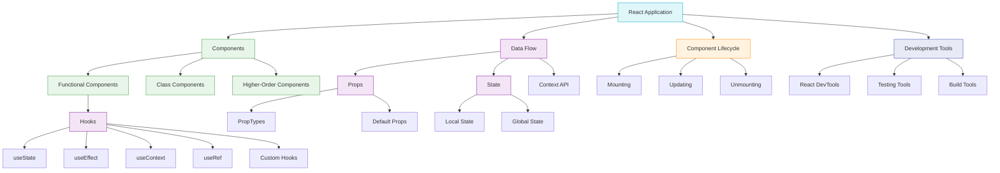

```mermaid
flowchart TD
    React[React Application] --> Components[Components]
    React --> DataFlow[Data Flow]
    React --> Lifecycle[Component Lifecycle]
    React --> Tools[Development Tools]

    Components --> FC[Functional Components]
    Components --> CC[Class Components]
    Components --> HOC[Higher-Order Components]

    FC --> Hooks[Hooks]
    Hooks --> useState[useState]
    Hooks --> useEffect[useEffect]
    Hooks --> useContext[useContext]
    Hooks --> useRef[useRef]
    Hooks --> CustomHooks[Custom Hooks]

    DataFlow --> Props[Props]
    DataFlow --> State[State]
    DataFlow --> Context[Context API]

    Props --> PropTypes[PropTypes]
    Props --> DefaultProps[Default Props]

    State --> LocalState[Local State]
    State --> GlobalState[Global State]

    Lifecycle --> Mounting[Mounting]
    Lifecycle --> Updating[Updating]
    Lifecycle --> Unmounting[Unmounting]

    Tools --> DevTools[React DevTools]
    Tools --> Testing[Testing Tools]
    Tools --> Bundling[Build Tools]

    style React fill:#e0f7fa,stroke:#00acc1
    style Components fill:#e8f5e9,stroke:#43a047
    style DataFlow fill:#f3e5f5,stroke:#8e24aa
    style Lifecycle fill:#fff3e0,stroke:#fb8c00
    style Tools fill:#e8eaf6,stroke:#3f51b5

    style FC fill:#e8f5e9,stroke:#43a047
    style CC fill:#e8f5e9,stroke:#43a047
    style HOC fill:#e8f5e9,stroke:#43a047

    style Hooks fill:#f3e5f5,stroke:#8e24aa
    style Props fill:#f3e5f5,stroke:#8e24aa
    style State fill:#f3e5f5,stroke:#8e24aa
```
