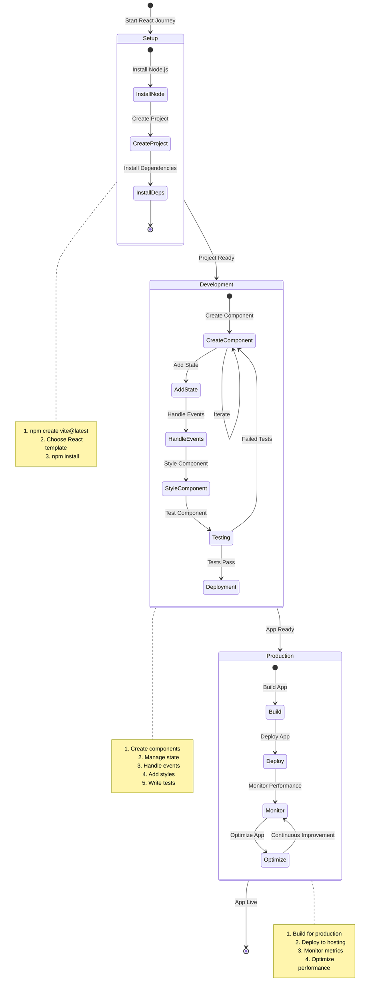

```mermaid
stateDiagram-v2
    [*] --> Setup: Start React Journey

    state Setup {
        [*] --> InstallNode: Install Node.js
        InstallNode --> CreateProject: Create Project
        CreateProject --> InstallDeps: Install Dependencies
        InstallDeps --> [*]
    }

    Setup --> Development: Project Ready

    state Development {
        [*] --> CreateComponent: Create Component
        CreateComponent --> AddState: Add State
        AddState --> HandleEvents: Handle Events
        HandleEvents --> StyleComponent: Style Component
        StyleComponent --> Testing: Test Component
        Testing --> Deployment: Tests Pass

        CreateComponent --> CreateComponent: Iterate
        Testing --> CreateComponent: Failed Tests
    }

    Development --> Production: App Ready

    state Production {
        [*] --> Build: Build App
        Build --> Deploy: Deploy App
        Deploy --> Monitor: Monitor Performance
        Monitor --> Optimize: Optimize App
        Optimize --> Monitor: Continuous Improvement
    }

    Production --> [*]: App Live

    note right of Setup
        1. npm create vite@latest
        2. Choose React template
        3. npm install
    end note

    note right of Development
        1. Create components
        2. Manage state
        3. Handle events
        4. Add styles
        5. Write tests
    end note

    note right of Production
        1. Build for production
        2. Deploy to hosting
        3. Monitor metrics
        4. Optimize performance
    end note
```
